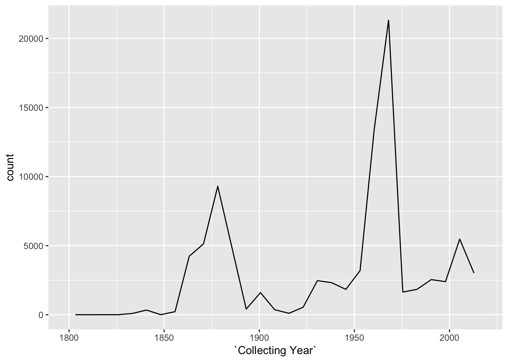
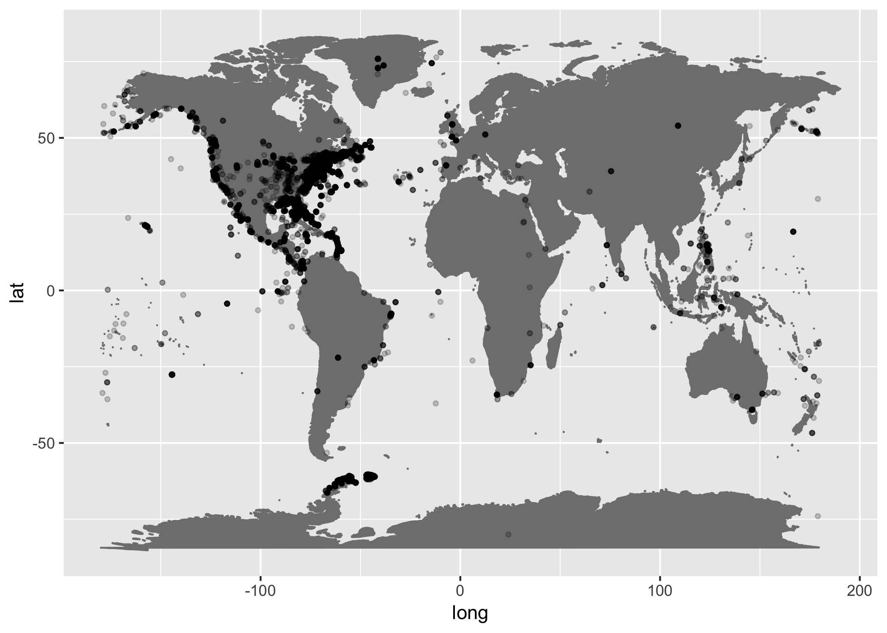

# Peabody Invertebrate Zoology Collections Statistics

This document describes a variety of statistics about the [Peabody
Invertebrate Zoology
Collections](http://peabody.yale.edu/collections/invertebrate-zoology).

The data were obtained from Daniel Drew on January 8,
    2018.

    ## [1] 139125

    ##  [1] "Catalog Number"                "Phylum"                       
    ##  [3] "Class"                         "Order"                        
    ##  [5] "Family"                        "Genus"                        
    ##  [7] "Scientific Name"               "Type Status"                  
    ##  [9] "Ocean"                         "Sea/Gulf"                     
    ## [11] "Bay/Sound"                     "Continent"                    
    ## [13] "Country"                       "State/Province"               
    ## [15] "County"                        "City/Town/Nearest Named Place"
    ## [17] "Precise Locality"              "Collector/Expedition"         
    ## [19] "Latitude (dec)"                "Longitude (dec)"              
    ## [21] "Minimum Depth In Meters"       "Maximum Depth In Meters"      
    ## [23] "Collecting Year"               "Collecting Month"             
    ## [25] "Collecting Day"                "Lot Count"                    
    ## [27] "Prep Type"

| Description |      N |
| :---------- | -----: |
| All Records | 139125 |
| Lat and Lon |  49101 |

| Taxon                    | N.Var1                   | N.Freq |
| :----------------------- | :----------------------- | -----: |
| Acanthocephala           | Acanthocephala           |    227 |
| Algae                    | Algae                    |      7 |
| Amoebozoa                | Amoebozoa                |    145 |
| Annelida                 | Annelida                 |  15475 |
| Apicomplexa              | Apicomplexa              |    329 |
| Arthropoda               | Arthropoda               |  28801 |
| Ascomycota               | Ascomycota               |      5 |
| Bigyra                   | Bigyra                   |      3 |
| Brachiopoda              | Brachiopoda              |    303 |
| Bryophyta                | Bryophyta                |      1 |
| Bryozoa                  | Bryozoa                  |   3781 |
| Chaetognatha             | Chaetognatha             |     47 |
| Charophyta               | Charophyta               |      7 |
| Chlorophyta              | Chlorophyta              |     61 |
| Chordata                 | Chordata                 |   1671 |
| Ciliophora               | Ciliophora               |    645 |
| Cnidaria                 | Cnidaria                 |  11618 |
| Cryptophyta              | Cryptophyta              |      3 |
| Ctenophora               | Ctenophora               |     29 |
| Cyanobacteria            | Cyanobacteria            |      9 |
| Cyanophyta               | Cyanophyta               |      2 |
| Cycliophora              | Cycliophora              |      1 |
| Diatoms                  | Diatoms                  |      1 |
| Echinodermata            | Echinodermata            |   6667 |
| Echiura                  | Echiura                  |     27 |
| Entoprocta               | Entoprocta               |     25 |
| Euglenozoa               | Euglenozoa               |    165 |
| Foraminifera             | Foraminifera             |    401 |
| Gastrotricha             | Gastrotricha             |      1 |
| Hemichordata             | Hemichordata             |     44 |
| Ichnofossil (vertebrate) | Ichnofossil (vertebrate) |      2 |
| Kinorhyncha              | Kinorhyncha              |     25 |
| Metamonada               | Metamonada               |     57 |
| Microsporidia            | Microsporidia            |    118 |
| Mollusca                 | Mollusca                 |  45169 |
| Myzozoa                  | Myzozoa                  |     12 |
| Nematoda                 | Nematoda                 |    692 |
| Nematomorpha             | Nematomorpha             |     21 |
| Nemertea                 | Nemertea                 |    526 |
| Nemertina                | Nemertina                |    803 |
| Ochrophyta               | Ochrophyta               |    164 |
| Onychophora              | Onychophora              |     34 |
| Phaeophyta               | Phaeophyta               |      1 |
| Phoronida                | Phoronida                |     45 |
| Placidozoa               | Placidozoa               |     19 |
| Platyhelminthes          | Platyhelminthes          |   3340 |
| Pogonophora              | Pogonophora              |      1 |
| Porifera                 | Porifera                 |  16004 |
| Priapulida               | Priapulida               |     11 |
| Proteobacteria           | Proteobacteria           |      2 |
| Radiozoa                 | Radiozoa                 |      8 |
| Rhizopoda                | Rhizopoda                |     32 |
| Rhodophyta               | Rhodophyta               |     11 |
| Rotifera                 | Rotifera                 |    710 |
| Sarcomastigophora        | Sarcomastigophora        |     66 |
| Sipuncula                | Sipuncula                |     33 |
| Sipunculida              | Sipunculida              |    159 |
| Spirochaetes             | Spirochaetes             |      7 |
| Tardigrada               | Tardigrada               |     40 |
| Tracheophyta             | Tracheophyta             |     76 |
| Zygomycota               | Zygomycota               |      4 |

<!-- -->

| Name                                                                     |     N |
| :----------------------------------------------------------------------- | ----: |
| Systematics Ecology Program - Biotic Census                              | 13955 |
| U.S. Fish Comm. Stmr. Albatross                                          |  3755 |
| Bradley, F. H.                                                           |  3703 |
| Hartman, W. D.                                                           |  3336 |
| U.S. Fish Comm. Stmr. Fish Hawk                                          |  3104 |
| U.S. Fish Commission                                                     |  2993 |
| U.S. Fish Comm. Stmr. Speedwell                                          |  2833 |
| Parker, R. H.                                                            |  2723 |
| Kohn, A. J., Yale Seychelles Expedition (YSE) 1957-1958                  |  2551 |
| Hartman, W. D., Yale Seychelles Expedition (YSE) 1957-1958               |  2115 |
| Lazo-Wasem, E. A.                                                        |  1933 |
| Lazo-Wasem, E. A.; Baldinger, A. J.                                      |  1058 |
| Lazo-Wasem, E. A., Antarctic Marine Living Resources Cruise 2009, Leg II |   975 |
| Verrill, A. E.                                                           |   951 |
| Pedersen, J.                                                             |   915 |
| A. E. Verrill Bermuda Expedition 1898                                    |   834 |
| R/V A.E. Verrill                                                         |   829 |
| Banta, W. C.                                                             |   753 |
| Bishop, M. B.                                                            |   724 |
| Lazo-Wasem, E. A., FS Polarstern, Cruise XXVIII/4                        |   690 |
| Dick, M. H.                                                              |   576 |
| Yacht Pawnee, Cruise III                                                 |   570 |
| Agassiz, A. E., U.S. Coast Survey Stmr. Blake                            |   567 |
| Baldinger, A. J.                                                         |   550 |
| R/V Atlantis 1937                                                        |   547 |
| Robinson, N. J.                                                          |   537 |
| U.S. Coast Survey Stmr. Bache                                            |   519 |
| Norman, A. M.                                                            |   518 |
| Hartman, W. D.; Kohn, A. J., Yale Seychelles Expedition (YSE) 1957-1958  |   505 |
| Moore, J. A., R/V Delaware II, Cruise DE04-09                            |   438 |
| U.S. Exploring Expedition 1838-1842                                      |   438 |
| A. E. Verrill Bermuda Expedition 1898 or 1901                            |   403 |
| A. E. Verrill Expedition of 1870                                         |   391 |
| Morse, E. S.                                                             |   369 |
| Showalter, E. R.                                                         |   353 |
| A. E. Verrill Bermuda Expedition 1901                                    |   352 |
| Dai, C.                                                                  |   345 |
| Pena de Niz, A.                                                          |   345 |
| Verrill, A. E.; Smith, S. I.                                             |   345 |
| Paulay, G.                                                               |   338 |
| Gable, M. F.                                                             |   322 |
| Moore, J. A., R/V Delaware II Cruise DE02-06                             |   322 |
| A. E. Verrill Expedition of 1868                                         |   316 |
| Bishop, E. H.                                                            |   281 |
| Coe, W. R.                                                               |   273 |
| Palmer, E.                                                               |   271 |
| Porter, J. W.                                                            |   269 |
| Jewett, E.                                                               |   266 |
| R/V Atlantis 1935                                                        |   266 |
| Emerton, J. H.                                                           |   264 |
| Hechtel, G. J.                                                           |   253 |
| Kinzie, R. A.                                                            |   251 |
| Moore, J. A., R/V Ronald Brown Cruise RB04-04                            |   251 |
| Leigh, E. G.                                                             |   250 |
| A. E. Verrill and class                                                  |   247 |
| Richardson, D. J.                                                        |   239 |
| Bradley, C. W.                                                           |   237 |
| Lazo-Wasem, E. A., R/V Delaware II                                       |   236 |
| R/V Dolphin                                                              |   232 |
| Verrill, A. H.                                                           |   232 |
| R/V Dana II Expedition 1928-1930                                         |   231 |
| Simpson, T. L.                                                           |   228 |
| Wright, C.                                                               |   227 |
| Putnam, W. H.                                                            |   216 |
| Randall, J. E.                                                           |   215 |
| Yarrow, H. C.                                                            |   201 |
| Chapman, R.                                                              |   197 |
| Hummelinck, P. W.                                                        |   195 |
| Goode, G. B.                                                             |   193 |
| T.F. Goreau and party                                                    |   189 |
| Goreau, T. F.; Graham, E. A.                                             |   188 |
| Rojas, L. M.; Boardman, R. E.                                            |   188 |
| Bassindale, R.                                                           |   187 |
| Coons, W. T.                                                             |   186 |
| Watson, P.                                                               |   182 |
| Goreau, T. F.                                                            |   180 |
| Smith, S. I.                                                             |   178 |
| Carpenter, P. P.                                                         |   177 |
| Packard, A. S.                                                           |   175 |
| Reiswig, H. M.                                                           |   169 |
| Bergmann, W.                                                             |   168 |
| Odum, H. T., R/V Albatross III Cruise 31A                                |   166 |
| Coe, W. R., Harriman Alaska Expedition                                   |   164 |
| Hunt, E. B.                                                              |   161 |
| Minor, W. C.                                                             |   161 |
| Strength in Numbers Workshop (2013)                                      |   160 |
| Abbott, D. P.                                                            |   157 |
| Bishop, M. B., R/V Atlantis 1933                                         |   154 |
| Freund, R.                                                               |   153 |
| Kuhn, K. L., R/V Laurence M. Gould                                       |   153 |
| Yacht Pawnee, Cruise I                                                   |   153 |
| Elder, L. E.; Culligan, C. R.; Rojas, L. M.                              |   151 |
| Rojas, L. M.                                                             |   151 |
| Lang, J. C.                                                              |   149 |
| R/V Velero IV                                                            |   147 |
| Moore, J. A., R/V Fishery Researcher I                                   |   143 |
| Yale Seychelles Expedition (YSE) 1957-1958                               |   141 |
| Yacht Pawnee, Cruise II                                                  |   140 |
| Burkenroad, M. D.                                                        |   132 |
| Xantus, J.                                                               |   130 |

## Locations

<!-- -->

## Arianna queries

### Most prolific collectors

Most collections are from the US Fish Commission cruises, so I’ll
separate these out.

<!-- -->

Here are the non US Fish Commission cruises collectors.

<!-- -->

## Sub regions

<!-- -->
